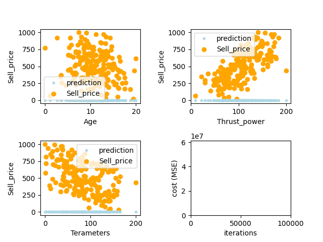

# linear_regression
A simple Python program implementing **linear** and **polynomial regressions** over datasets and **ploting the learning process in real-time**.  
This program is build upon my [TinySciKit library]().  




# Motivation
This program is based on an [introductory project](https://cdn.intra.42.fr/pdf/pdf/455/ft_linear_regression.fr.pdf "Suject here!") from the 42 curriculum and broadly enhanced.  
The original project only required to implement univariate linear regression from scratch.

# Requirements
- numpy
- pandas
- matplotlib
- joblib

# Features
## Multivariate regression

## Linear models
* Linear regression  
  Example: `python3 train.py data/train/spacecraft_data.csv linear`

* Ridge regression: linear regression using L2 regularization to limit overfitting  
  Example: `python3 train.py data/train/spacecraft_data.csv ridge`

## Scaling methods 
* Standard scaler  
  Example: `python3 train.py data/train/spacecraft_data.csv ridge standard`
  
* Min-max scaler  
  Example: `python3 train.py data/train/spacecraft_data.csv linear minmax`

## Polynomial models
  * Generate polynomial features for each parameters of the dataset up to the given power
  Example: `python3 train.py data/train/spacecraft_data.csv linear minmax 8`

## Awesome real-time plot of the learning process (up to 15 features)

## Save the predictions onto a .csv file

# Installation
## Install the required libraries: 
`pip install -r requirements.txt`

# Usage
## Train the model
`python3 train.py [datapath]`
* Example:   
  ```
    $ python3 train.py data/train/spacecraft_data.csv

    No arguments given. The program will use the default parameters: ['linear', 'standard', '1'].
    Feeding data to the model's pipeline.
    Model trained.
    Model saved as model.pkl
  ```


The training process can take more optional arguments (see features part above):  
`python3 train.py [datapath] [model] [scaler] [polynomial_value]`
*   Example:
    ```
    $ python3 train.py data/train/spacecraft_data.csv linear standard 8
    
    Feeding data to the model's pipeline.
    Model trained.
    Model saved as model.pkl
    ```

## Predict over data 
`python3 predict.py [data]`
* Example:
  ``` 
    $ python3 predict.py 3 2000 5

    Results:
        0       1    2   predictions
    0  3.0  2000.0  5.0  10753.997844
    Save results? [y,n]
  ```

## Predict over .csv dataset 
`python3 predict_from_csv.py [datapath]`
* Example:
  ```
    $ python3 predict.py data/test/spacecraft_data.csv

    Results:
           Age  Thrust_power  Terameters  predictions
    0     0.000000    102.884445   30.117605   836.760917
    1     1.144554      9.000000   96.110216   140.230460
    2     3.420318     21.804128   11.971169   400.035828
    3     3.604186     30.035427   63.635897   294.780212
    4     2.660055    129.444990   27.010236   934.096337
    ..         ...           ...         ...          ...
    195  19.367781     95.957785  139.184178   130.783184
    196  17.292362    131.718738  102.329786   459.757283
    197  17.769504    110.547066  104.018450   335.533151
    198  20.000000    178.680560   80.353100   715.568745
    199  19.575478    200.000000  200.000000   499.587252

    [200 rows x 4 columns]
    Save results? [y,n]
  ```


# Data
Datasets can be found in `data/train` and `data/test` repositories.
*  `data/train` contains the values to predict as a final column.
*  `data/test` contains the feature needed to do the prediction.